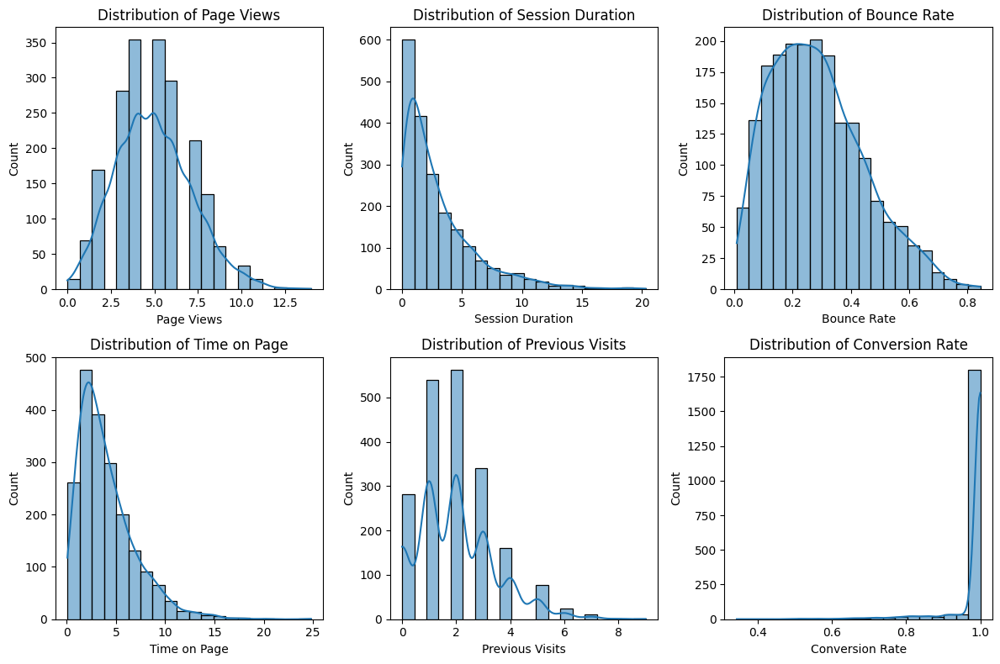
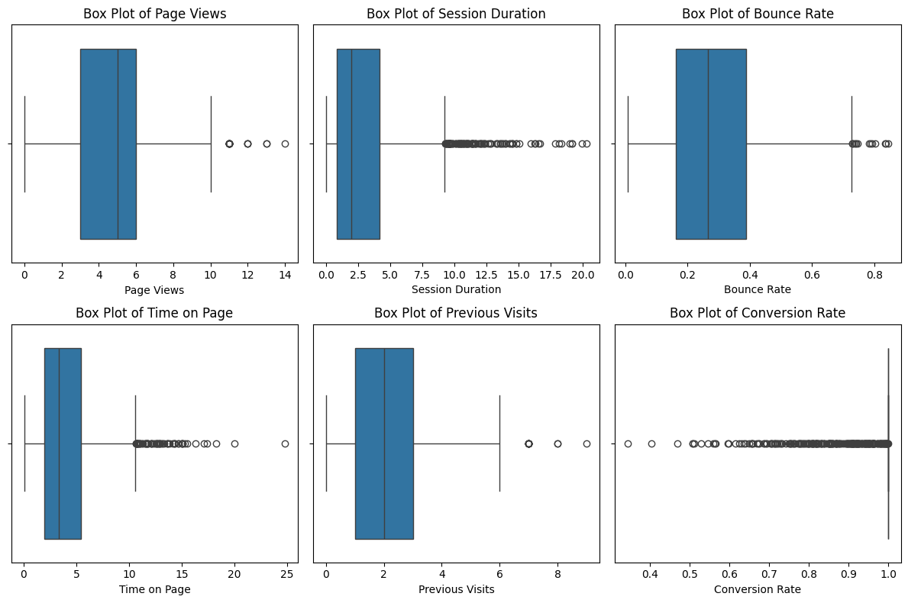
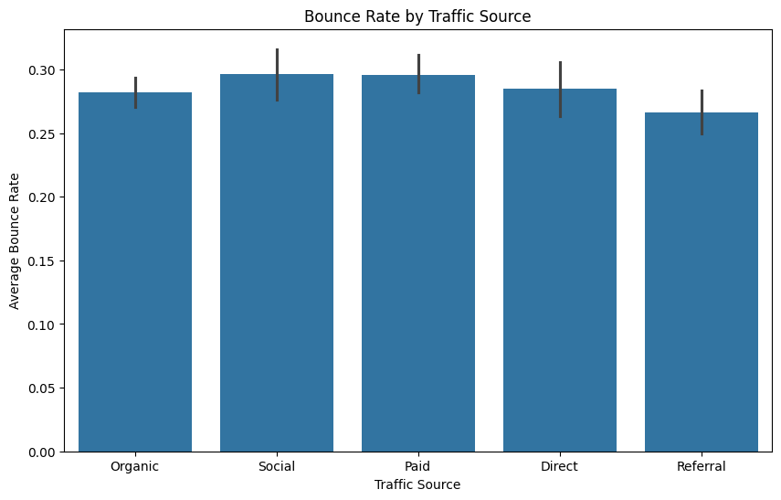
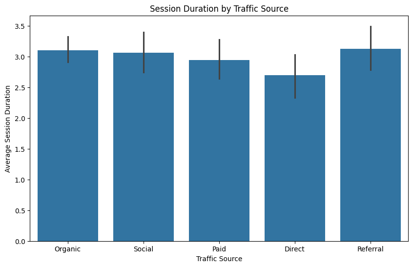
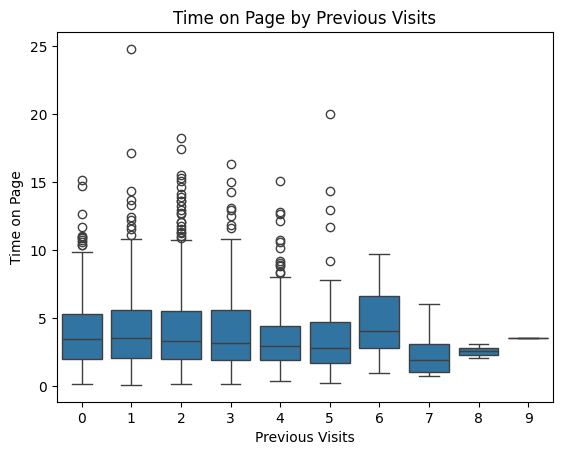

# Exploratory Data Analysis (EDA) Report on Website Traffic Data

## Table of Contents
1. [Introduction](#introduction)
2. [Dataset Overview](#dataset-overview)
3. [Data Cleaning and Preparation](#data-cleaning-and-preparation)
4. [Exploratory Data Analysis](#exploratory-data-analysis)
   - [Numerical Data Analysis](#numerical-data-analysis)
   - [Categorical Data Analysis](#categorical-data-analysis)
5. [Data Visualisation](#data-visualisation)
   - [Histograms and KDE Plots](#histograms-and-kde-plots)
   - [Box Plots](#box-plots)
   - [Traffic Source Insights](#traffic-source-insights)
6. [Key Insights](#key-insights)
7. [Conclusion](#conclusion)

## Introduction

This report presents a comprehensive exploratory data analysis of a website traffic dataset. The aim is to clean, explore, and visualise the data to uncover actionable insights. This project is currently being undertaken as part of my HNG internship, utilising Python for data analysis. For the complete analysis, refer to the full Jupyter Notebook: [EDA.ipynb](./EDA.ipynb).

 
## Data Source

The dataset, `website_dataset.csv`, contains website traffic-related information, including page views, session duration, bounce rate, traffic sources, time on page, previous visits, and conversion rate. It was provided as a case study for applying data cleaning, standardisation, and optimisation techniques.

Using the `data.shape` function, it was discovered that the dataset contains **2000 rows** and **7 columns**, providing a comprehensive set of website traffic data for analysis.

## Tools

- **Jupyter Notebook**: Used as the primary environment for writing and executing code.
- **Python**: The primary language for data manipulation.
- **Pandas**: For data loading, exploration, and cleaning.
- **Matplotlib (plt)**: For data visualisation, helping to analyse and display patterns.
- **Seaborn**: Used for advanced data visualisation and statistical plotting.

## Dataset Overview

- **Total Rows**: 2000  
- **Total Columns**: 7  
- **Features**:  
  - **Page Views** (int)
  - **Session Duration** (float)
  - **Bounce Rate** (float)
  - **Traffic Source** (categorical)
  - **Time on Page** (float)
  - **Previous Visits** (int)
  - **Conversion Rate** (float)

```python
# Installing necessary libraries before loading the dataset
import pandas as pd
import matplotlib.pyplot as plt
import seaborn as sns

# Load dataset
website = pd.read_csv("website_dataset.csv")
print("File loaded successfully")

# Check the number of rows and columns
print(website.shape)

# Display dataset summary
website.info()
```

## Data Cleaning and Preparation

Raw data often contains inconsistencies, errors, and missing values. In this phase, I:

- Verified non-null counts for each column
- Confirmed that data types were appropriate
- Handled inconsistencies to ensure reliable analysis

```python
# Checking for missing values
print(website.isnull().sum())
```

## Exploratory Data Analysis

### Numerical Data Analysis

```python
# Display summary statistics
print(website.describe())
```

This function provides key summary statistics for numerical columns, including count, mean, standard deviation, min, and max values. It helps in understanding the distribution and potential anomalies in the dataset.

- **Page Views**: Right-skewed distribution with a median of 5, some outliers reaching 14.
- **Session Duration**: Most sessions last around 2 seconds, with some extreme outliers.
- **Bounce Rate**: Ranges from 0.0079 to 0.8449, median around 26.6%.
- **Time on Page**: Similar to session duration, with some high outliers.
- **Previous Visits**: Most users have around 2 previous visits.
- **Conversion Rate**: Mostly 1, with a few anomalies.

### Categorical Data Analysis

```python
# Display frequency of traffic sources
print(website['Traffic Source'].value_counts())
```

## Data Visualisation

### Histograms and KDE Plots


```python
numerical_cols = ['Page Views', 'Session Duration', 'Bounce Rate', 'Time on Page', 'Previous Visits', 'Conversion Rate']
plt.figure(figsize=(12, 8))
for i, col in enumerate(numerical_cols, 1):
    plt.subplot(2, 3, i)
    sns.histplot(website[col], kde=True, bins=20)
    plt.title(f'Distribution of {col}')
plt.tight_layout()
plt.show()
```
Histograms and KDE plots provide insights into the distribution of numerical variables, helping to identify skewness, peaks, and possible outliers in the dataset.

### Box Plots


```python
plt.figure(figsize=(12, 8))
for i, col in enumerate(numerical_cols, 1):
    plt.subplot(2, 3, i)
    sns.boxplot(x=website[col])
    plt.title(f'Box Plot of {col}')
plt.tight_layout()
plt.show()
```

Box plots highlight the spread of data and detect outliers. The presence of extreme values can indicate data inconsistencies or unique user behavior patterns.


### Traffic Source Insights




```python
traffic_summary = website.groupby("Traffic Source").agg(
    Avg_Session_Duration=("Session Duration", "mean"),
    Avg_Conversion_Rate=("Conversion Rate", "mean"),
    Bounce_Rate=("Bounce Rate", "mean")
).sort_values(by="Avg_Conversion_Rate", ascending=False)
print(traffic_summary)
```

This code groups the dataset by traffic source and calculates key performance metrics, such as average session duration, conversion rate, and bounce rate. This helps to compare how different traffic sources perform in driving user engagement.

```python
plt.figure(figsize=(10, 6))
sns.barplot(data=website, x="Traffic Source", y="Bounce Rate")
plt.title("Bounce Rate by Traffic Source")
plt.ylabel("Average Bounce Rate")
plt.show()
```

## Key Insights

- **User Engagement**: Most users view between 3–7 pages per session; the conversion rate is predominantly high.
- **Outliers**: Some metrics, such as session duration and time on page, show notable outliers, indicating that a small subset of users is highly engaged.
- **Traffic Source Performance**: Organic traffic is the most prevalent, while referral traffic exhibits the best engagement (longer sessions and lower bounce rates).
- **Opportunities for Improvement**: Lower engagement from paid and direct traffic sources suggests potential areas for further optimisation.

## Conclusion

This exploratory data analysis provides a solid foundation for understanding website user behaviour. The report identifies key trends, outliers, and traffic source differences that offer actionable insights for optimising digital marketing strategies. As I continue to develop my skills during my HNG internship, I remain committed to utilising data-driven approaches to enhance business outcomes.
