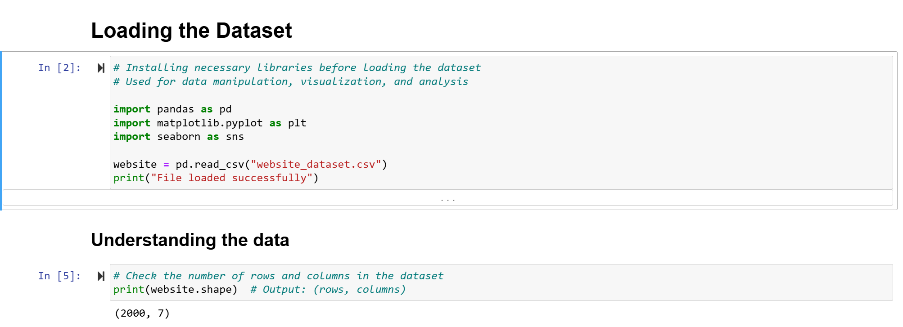

# Exploratory Data Analysis
 Exploratory Data Analysis (EDA) Report on Website Traffic Data
## Introduction

This report presents a comprehensive exploratory data analysis of a website traffic dataset. The objective is to clean, explore, and visualise the data to uncover actionable insights. Currently, this project is being undertaken as part of my HNG internship, utilising Python libraries such as `pandas`, `matplotlib`, and `seaborn`.

## Dataset Overview

- **Total Rows**: 2000  
- **Total Columns**: 7  
- **Features**:  
  - **Page Views** (int)
  - **Session Duration** (float)
  - **Bounce Rate** (float)
  - **Traffic Source** (categorical)
  - **Time on Page** (float)
  - **Previous Visits** (int)
  - **Conversion Rate** (float)

  